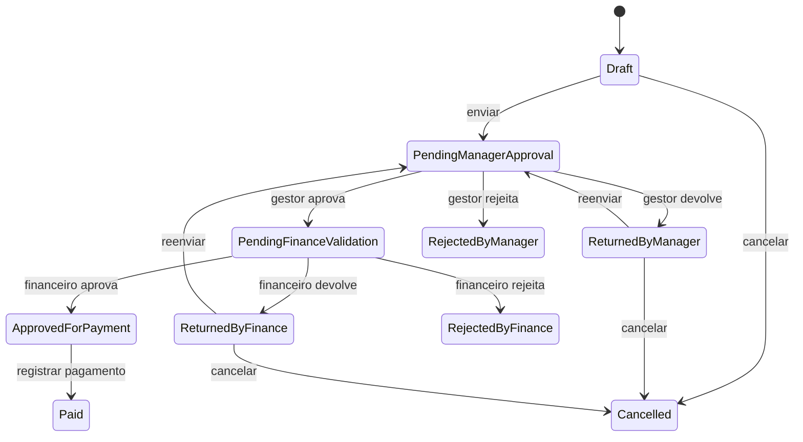

# Gestão de Reembolsos Corporativos

> API corporativa para criar, aprovar, validar e pagar solicitações de reembolso de despesas.

## Índice

- [Objetivo](#objetivo)
- [Perfis e permissões](#perfis-e-permissões)
- [Fluxo da solicitação](#fluxo-da-solicitação)
- [Modelo de dados](#modelo-de-dados)
- [Regras de negócio](#regras-de-negócio)
- [API](#api)
- [Arquitetura](#arquitetura)
- [Checklist de implementação](#checklist-de-implementação)
- [Dados para desenvolvimento](#dados-para-desenvolvimento)
- [Estratégia Git](#estratégia-git)

## Objetivo

Este sistema permite que colaboradores registrem despesas corporativas pagas com recursos próprios. As solicitações seguem por aprovação do gestor, validação financeira e registro de pagamento, mantendo histórico auditável de todas as alterações.

O projeto foi definido para exercitar Controllers, DTOs, validações, autenticação JWT, autorização por perfil, Services, Repositories, Entity Framework Core, SQL Server, logs, testes e controle de concorrência.

## Perfis e permissões

| Perfil | Permissões |
|---|---|
| `Employee` | Criar, editar, enviar, cancelar e acompanhar as próprias solicitações. |
| `Manager` | Consultar e decidir solicitações pendentes de subordinados diretos. |
| `Finance` | Validar solicitações aprovadas pelo gestor e registrar pagamentos. |
| `Admin` | Todas as permissões do Finance, além da administração de usuários, departamentos e categorias. |

> A autorização por perfil não substitui a autorização contextual: por exemplo, um gestor só pode decidir solicitações cujo colaborador tenha esse gestor definido como superior direto.

## Fluxo da solicitação

Estados finais: `RejectedByManager`, `RejectedByFinance`, `Cancelled` e `Paid`.

## Modelo de dados

### Entidades principais

| Entidade | Finalidade | Relacionamentos |
|---|---|---|
| `Department` | Departamento e centro de custo. | 1:N com `User`. |
| `User` | Colaborador autenticado e seu perfil. | N:1 com departamento; auto-relacionamento com gestor. |
| `ExpenseCategory` | Categoria, limite mensal e regra de comprovante. | 1:N com `ExpenseItem`. |
| `ReimbursementRequest` | Solicitação consolidada. | N:1 com colaborador; 1:N com despesas, decisões e histórico; 1:1 com pagamento. |
| `ExpenseItem` | Despesa individual. | N:1 com solicitação e categoria. |
| `ApprovalDecision` | Decisão do gestor ou financeiro. | N:1 com solicitação e decisor. |
| `Payment` | Registro do pagamento efetuado. | 1:1 com solicitação. |
| `RequestStatusHistory` | Trilha de auditoria de status. | N:1 com solicitação e usuário responsável. |

### Campos essenciais

| Entidade | Campos obrigatórios relevantes |
|---|---|
| `Department` | `Id`, `Name` único, `CostCenterCode` único, `IsActive`. |
| `User` | `FullName`, `Email` único, `PasswordHash`, `Role`, `DepartmentId`, `IsActive`. |
| `ExpenseCategory` | `Name` único, `MonthlyLimit` opcional, `RequiresReceipt`, `IsActive`. |
| `ReimbursementRequest` | `RequestNumber` único, `EmployeeId`, `DepartmentId`, `ReferenceMonth`, `Status`, `TotalAmount`, `Version`. |
| `ExpenseItem` | `ReimbursementRequestId`, `ExpenseCategoryId`, `ExpenseDate`, `Description`, `MerchantName`, `Amount`. |
| `ApprovalDecision` | `ReimbursementRequestId`, `DecidedByUserId`, `DecisionLevel`, `Decision`, `CreatedAtUtc`. |
| `Payment` | `ReimbursementRequestId` único, `PaymentReference` único, `PaidAmount`, `PaymentDate`, `ProcessedByUserId`. |
| `RequestStatusHistory` | `ReimbursementRequestId`, `PreviousStatus`, `NewStatus`, `ChangedByUserId`, `CreatedAtUtc`. |

## Regras de negócio

### Solicitações e despesas

- [ ] Toda solicitação inicia em `Draft`.
- [ ] Apenas o proprietário pode editar ou cancelar sua solicitação.
- [ ] Edição é permitida somente em `Draft`, `ReturnedByManager` e `ReturnedByFinance`.
- [ ] Para envio, a solicitação deve possuir ao menos uma despesa válida e total maior que zero.
